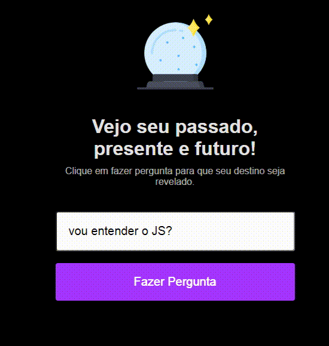

# Maratona Explorer

Projeto desenvolvido durante a Maratona Explore produzida pela Rockeseat ministrada por Mayk Brito.

## Desafio

Fazer um jogo de videncia, onde o usuário colocará sua pergunta e ao fazer recebera uma resposta alaeatória

## Linguagens utilizadas

- HTMl
- CSS
- Java Script
